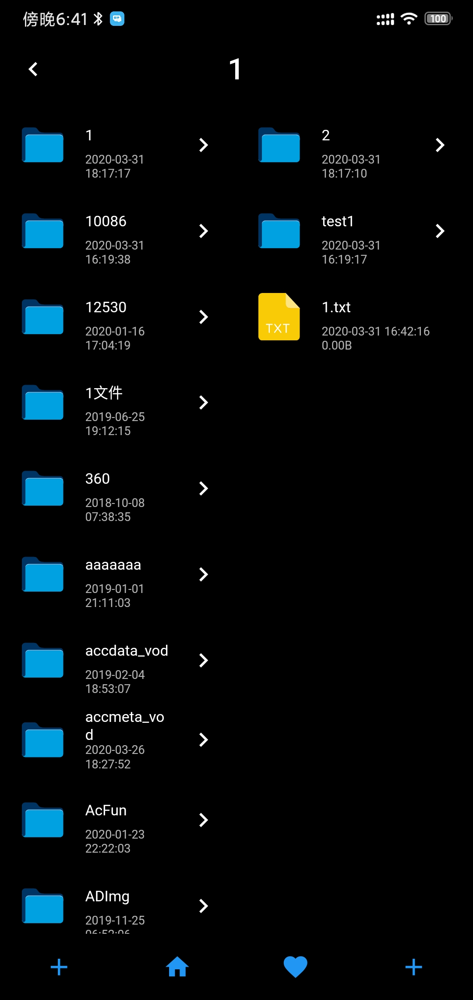
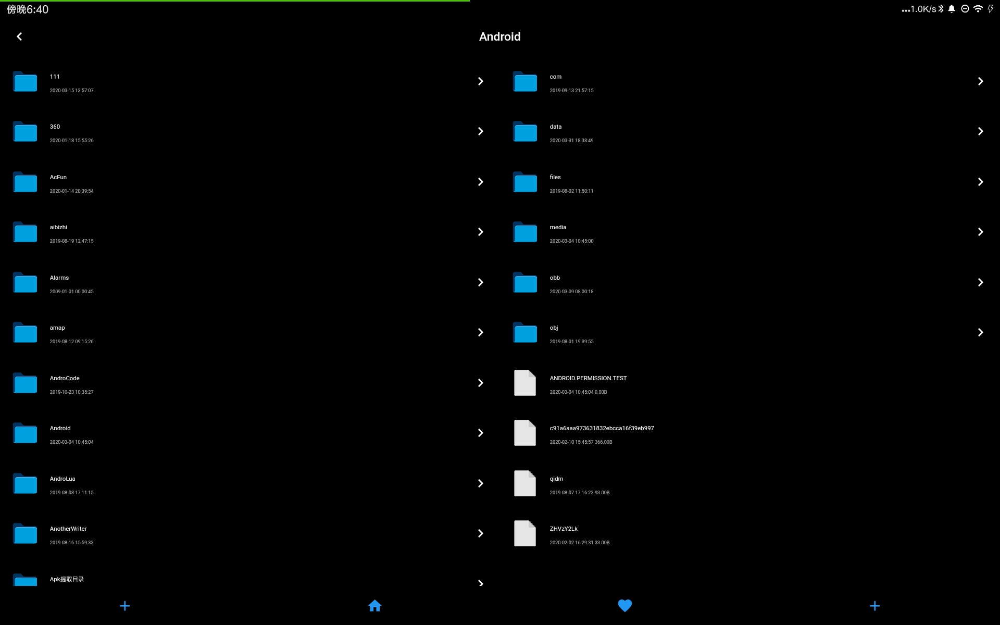
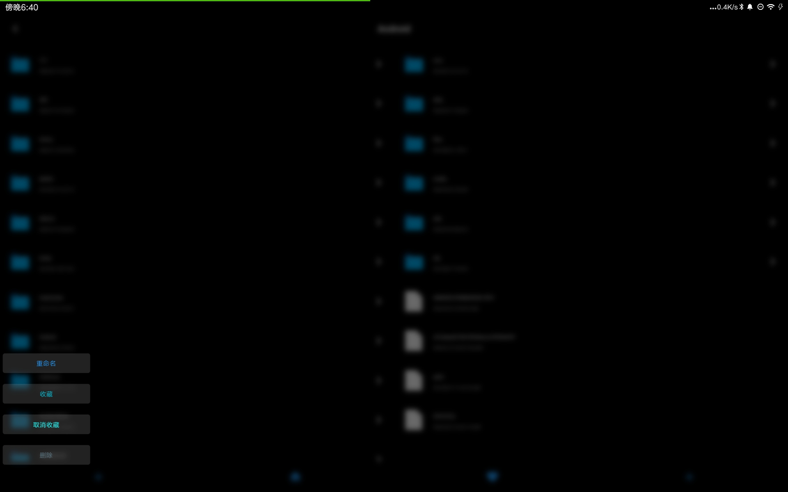
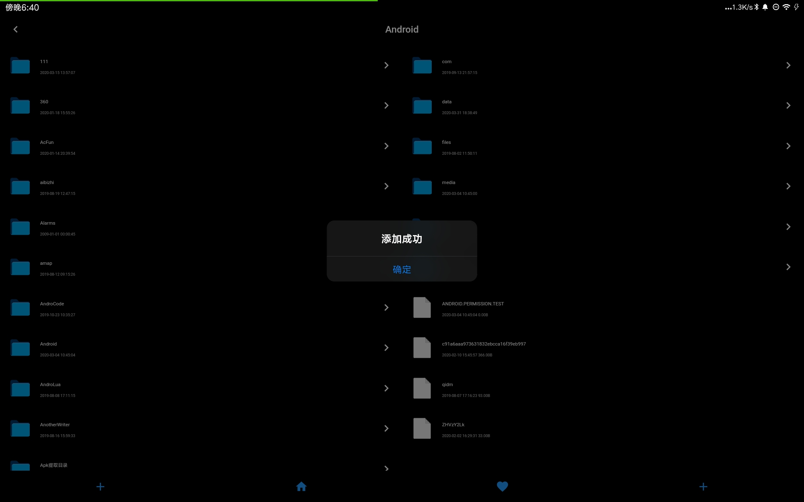

# flutter_file_manager

- 一个 双栏 Flutter 文件管理器(受ranger启发)
- 快速浏览: 左边显示上一级目录, 右边显示下一级目录
- 文件收藏: 只显示收藏的文件夹,去掉其他干扰

|  |  |  |  |
| ------------------------------------------------------------ | ------------------------------------------------------------ | ------------------------------------------------------------ | ------------------------------------------------------------ |
| 左侧父目录,右侧子目录                                        | 文件夹操作                                                   | 文件操作                                                     | 收藏的文件夹                                                 |

|  |  |
| ------------------------------------------------------------ | ------------------------------------------------------------ |
| 左侧父目录,右侧子目录                                        | 文件夹操作                                                   |
|  |  |
| 文件操作                                                     | 添加文件/文件夹到收藏                                        |

