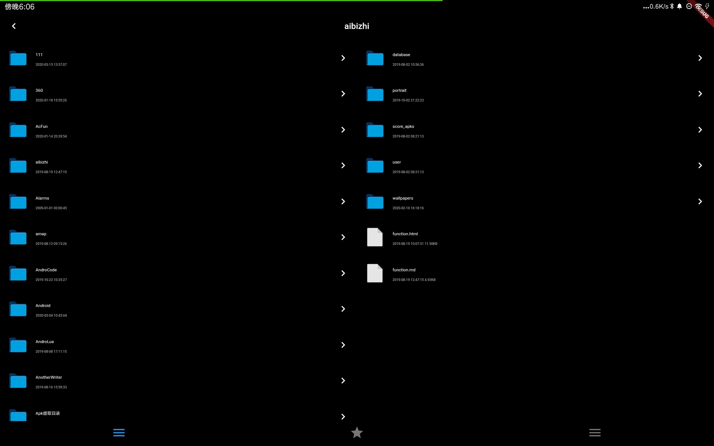
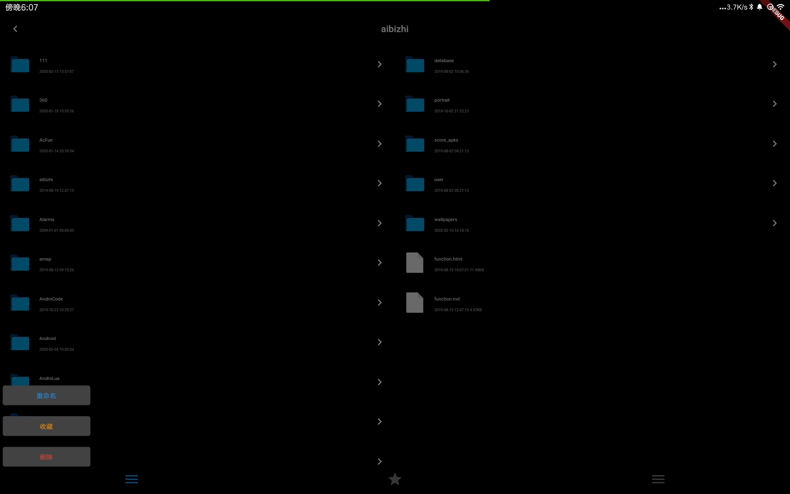
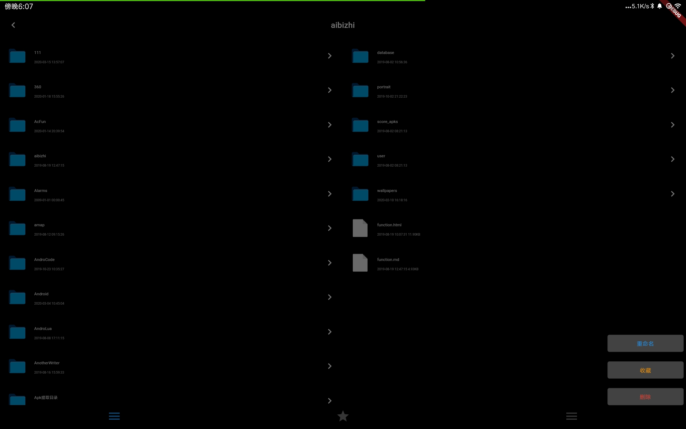
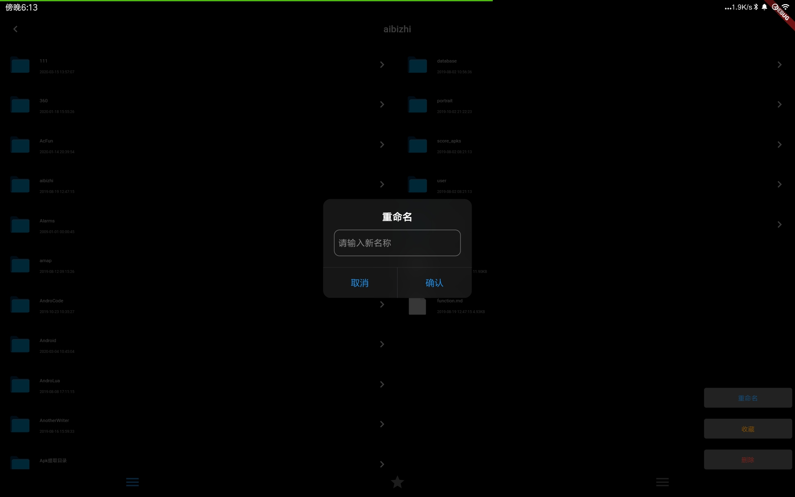
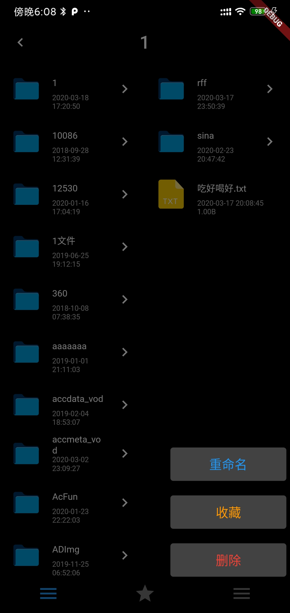

# flutter_file_manager

- 一个 双栏 Flutter 文件管理器
- 左边显示上一级目录, 右边显示下一级目录

|  |  |
| ------------------ | ------------------ |
|  |  |

|                    |                    |                    |                    |
| ------------------ | ------------------ | ------------------ | ------------------ |
|  |  |  |  |

- 我是想搞成ranger这样的

奈何实力不允许